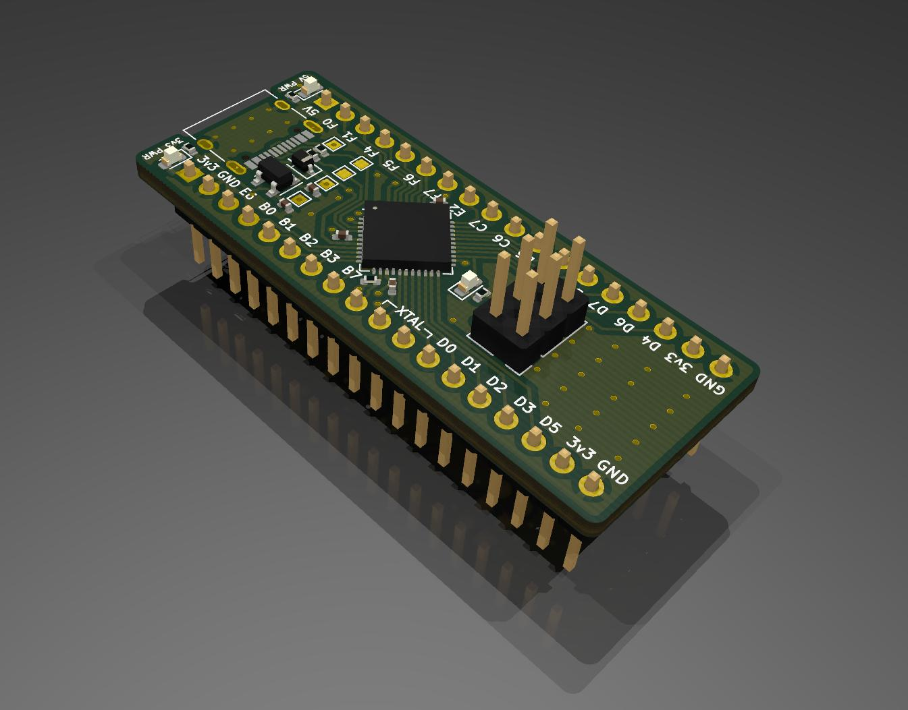

# atmegaXu4 breakout board

This board is a breakout for the atmegaXu4 chip by Atmel. It has a USB Type C connector to supply a USB Full Speed connection to a host PC, 5v to 3.3v LDO, and 3 LEDS for power and status indication. The 6 pin header provides an AVR ISP programming connection via SPI.

