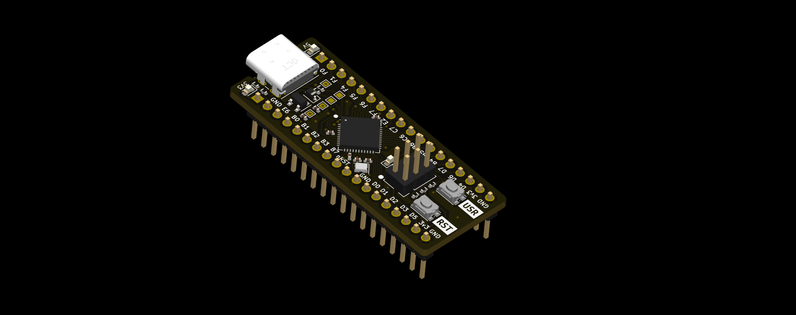

# ATmega32u4 Breakout Board

The ATmega32u4 breakout board makes it easy to get up and going with an AVR Microcontroller with plenty of IO features such as SPI, TWI, and UART as well as a Full-Speed USB interface. Standard pitch spacing on the headers allow it to be inserted into a breadboard and used for prototyping or through-hole soldered down onto a larger project/carrier board.

The getting started guide, hardware documentation and example firwmare for this board is available at [os.everydaydev.io](https://os.everydaydev.io/docs/atmega32u4_breakout). If you'd like to build one yourself, the latest Gerber files and schematics can be found in the [Release](https://github.com/everyday-dev/atmega32u4_breakout/releases) section on Github.

